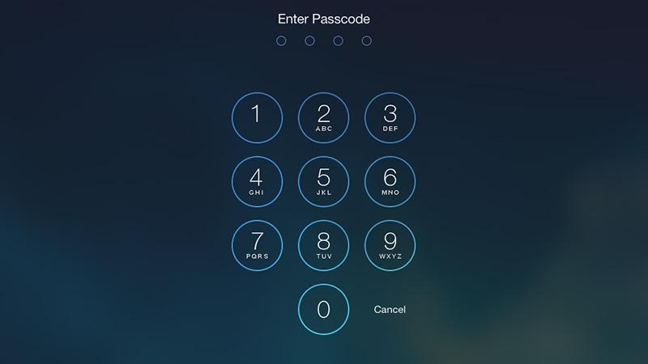
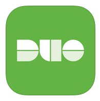

#How to Log on to the Rental iPad

##Short Description
These tips will help you access the full functionality of the rental iPad. These iPads are secured using Virginia Tech's security protocols, so in order to actually use the device, you'll have to follow the steps below.
##Requirements:
* You'll need access the the landline phone in the classroom.
    * Wi-Fi connection is preferred but not required.
* Your rental iPad.
* (OPTIONAL) The included iPad charger.

##Steps:
1. Using the **same** code provided to you to unlock your classroom rental, enter the digits into the iPad lockscreen.
  
* Once you have access to the iPad, you'll need to use Virginia Tech's two-factor authentication to access any paid app. In order to access these apps, you'll need to use Virginia Tech's two-factor authentication system. 
* 2. Open the app that is labled "Duo Mobile". 
   
3. Follow the on-screen prompts to receive a one-time phone call.
4. When Duo Mobile asks you to specify the phone number, enter the number that is labeled on the handset of the landline phone in the classroom. 
5. Wait for the Duo Mobile app to say "success" and display a green checkmark. 
6. Congratulations! You now have access to all the paid apps preloaded on all Virginia Tech airclassroom iPads! 
